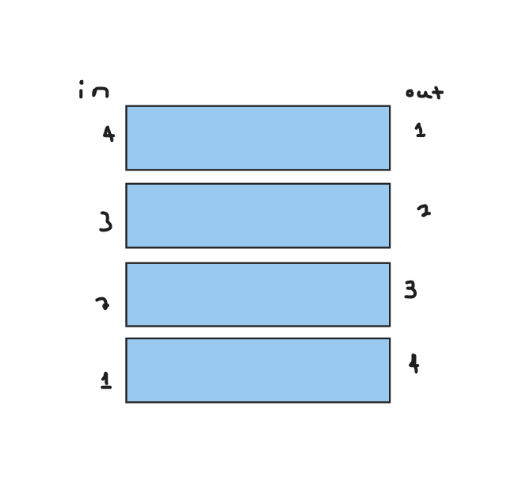

# Readings

## Understanding JavaScript Call Stack

1. What is a ‘call’?
    -Function invocation
2. How many ‘calls’ can happen at once?
    -One at a time
3. What does LIFO mean?
    - Last in First Out
4. Draw an example of a call stack and the functions that would need to be invoked to generate that call stack?
    
5. What causes a Stack Overflow?
    - When there is a recursive function without an exit point

## JavaScript error messages

1. What is a ‘reference error’?
    -Using a variable that is not yet declared
2. What is a ‘syntax error’?
    -when you have something that cannot be parsed in terms of syntax
3. What is a ‘range error’?
    -when you try to manipulate an object with an invalid length
4. What is a ‘type error’?
    -when the number/string you are trying to use or access is incompatible
5. What is a breakpoint?
    -Stops the code when an error occurs, and will not run the rest of the code after where the error occurs
